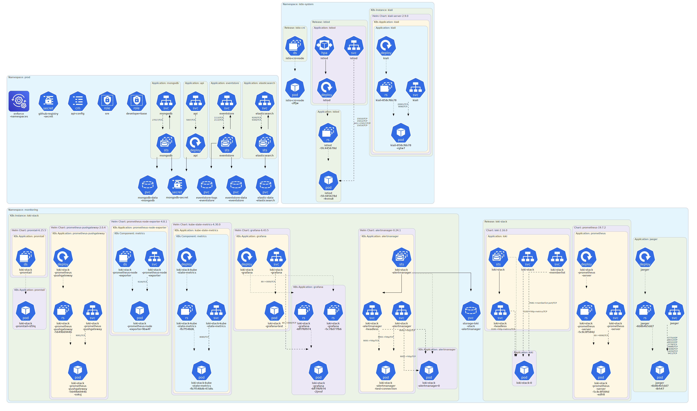
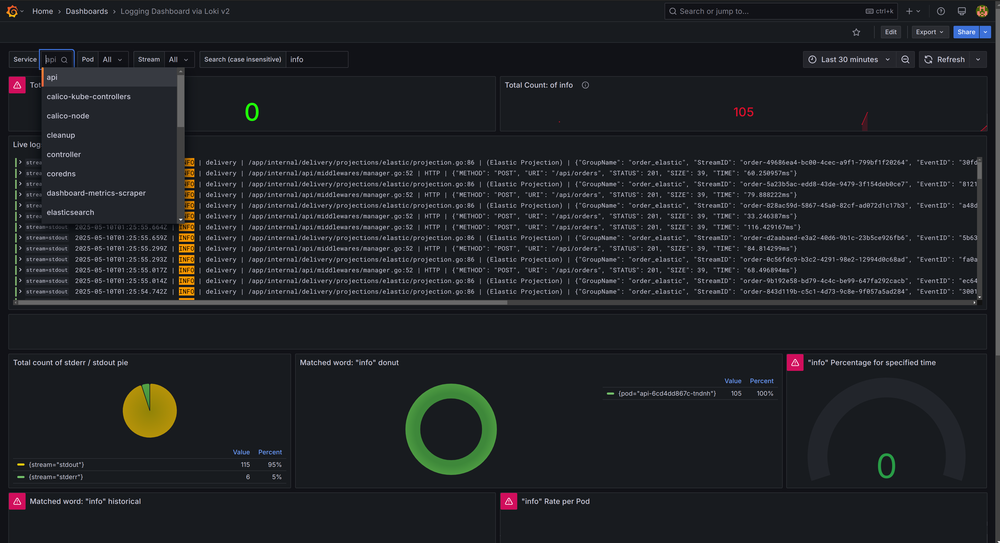
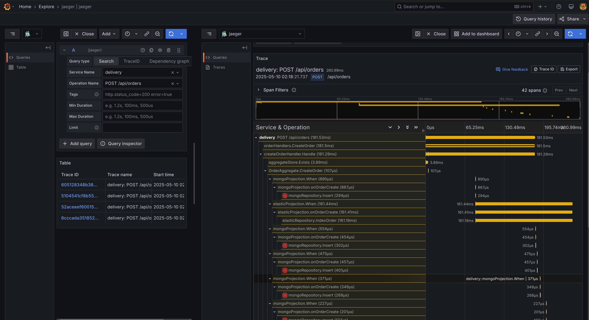
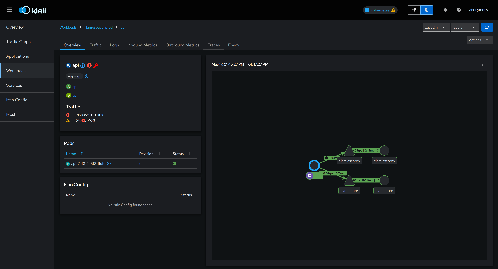
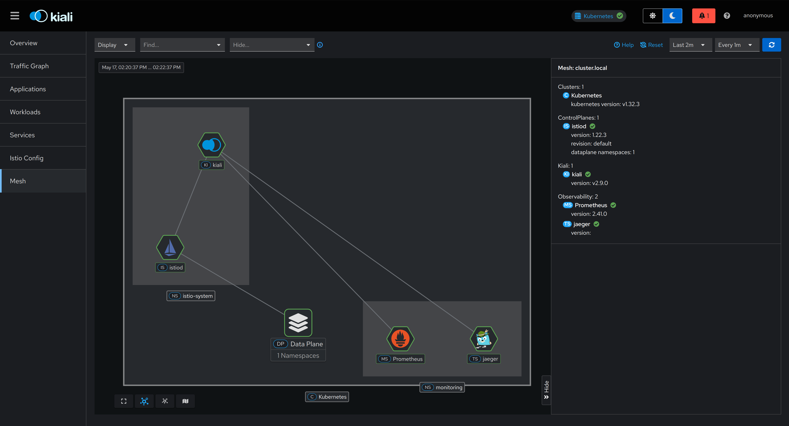
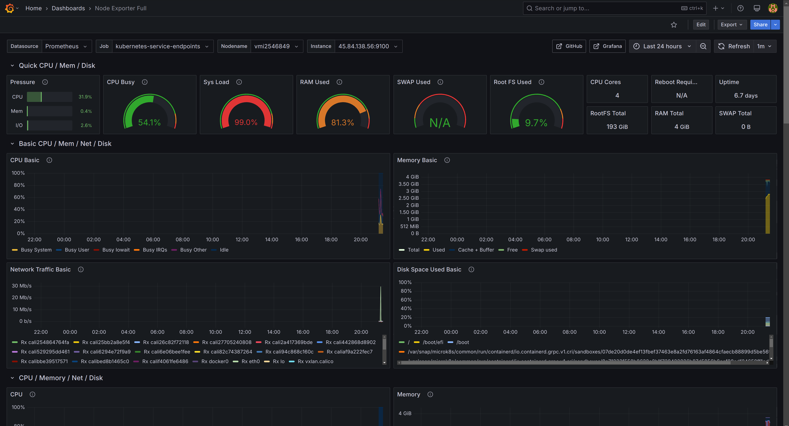

# **Motivation**

Pro tip: Don't drive blindfolded. 🏎️ 👮‍♂️

This project demonstrates a **production-grade observability setup** for a distributed system, capturing all three pillars of observability:
- **Logs**
- **Metrics**
- **Traces**

### **Okitou! why This Demo?**
The stack includes:
- A **Golang API** (because why not?) with **MongoDB**, **EventStore** and **Elasticsearch**.
- **Kubernetes manifests** across three namespaces (`prod`, `monitoring`, `istio-system`) to simulate a real multi-environment setup
- The full **observability toolkit**:
  - **Prometheus** + **Node Exporter** (metrics, because $htop is *so* 1999)
  - **Grafana** (With enough dashboards)
  - **Loki** + **Promtail**
  - **Jaeger** (To play detective)
  - **Kiali** (Who knows what's up with Istio)

Although you might not need EVERYTHING in this repo, this setup mirrors real-world observability needs, ensuring you can **monitor, alert, and troubleshoot** before users notice anything’s wrong.

#### Key Configuration
* Kustomize overlays for environment-specific configurations, although only worked on a "prod" setup.
* Separate RBAC restrictions for developer-base in production VS sre role.
* A base cluster policy using **kyverno** to ensure all namespaced resources are in [dev/prod/monitoring/istio-system].

## Prerequisites locally
- Docker
- Docker Compose
- go 1.24

## Setup

1. Copy `.env.example` to `.env`:
   ```sh
   cp .env.example .env
   go mod download
   ```

2. Start the application:
   ```sh
   make start
   ```

3. To run tests:
   ```sh
   make test
   ```

## Swagger

The REST API documentation is available at:  http://localhost:5007/swagger/index.html

## Project Structure

#### Internal Structure (DDD Approach)

The internal structure follows Domain-Driven Design (DDD) principles:

```sh
/internal
    ├── api
    │   ├── constants
    │   ├── dto
    │   ├── handlers
    │   ├── middlewares
    │   ├── server.go
    │   └── utils
    ├── delivery
    │   ├── aggregate
    │   ├── commands
    │   ├── events
    │   ├── models
    │   ├── projections
    │   ├── queries
    │   ├── repository
    │   └── services
    └── infrastructure
        ├── elasticsearch
        ├── es
        ├── eventstore
        ├── mongodb
        └── tracing
```

The structure separates concerns according to DDD layers:
- `api`: Presentation layer handling HTTP requests/responses
- `delivery`: Core domain logic and business rules
- `infrastructure`: Technical implementation details and external integrations
---

#### Cluster Diagram


#### Cluster Structure
```sh
deployments
├── base
│   ├── api
│   ├── configs
│   │   ├── clusterroles.yaml
│   │   ├── configmaps.yaml
│   │   ├── github-registry-secret.yaml
│   │   ├── kustomization.yaml
│   │   ├── mongodb-secret.yaml
│   │   └── policy.yaml
│   ├── elasticsearch
│   ├── eventstore
│   ├── kustomization.yaml
│   └── mongodb
├── components
│   ├── istio
│   │   ├── charts
│   │   ├── generator.yaml
│   │   └── kustomization.yaml
│   ├── kustomization.yaml
│   ├── kustomizeconfig.yaml
│   └── monitoring
│       ├── charts
│       ├── generator.yaml
│       ├── jaeger
│       ├── kustomization.yaml
│       └── values.yaml
└── overlays
    └── prod
        ├── kustomization.yaml
        └── patches
            ├── api-svc.yaml
            └── restrict-developer-permissions.yaml
```

#### Screenshots





