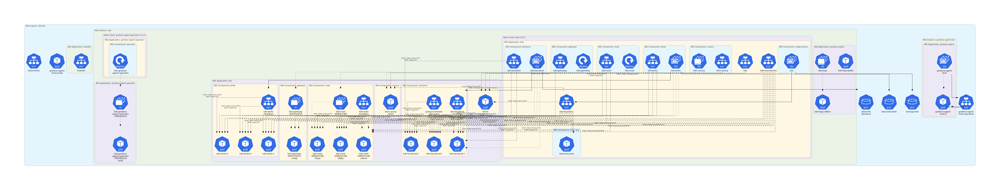

## No docs for now, still an ongoing repo

---
https://grafana.com/docs/agent/latest/operator/getting-started/
had to add CRDs by hand (will be documented)

---

remove anti-affinity rules from the chart, couldve been turned into soft

---
TODO:
- add loki?
- add svc mesh?
- add rbac?
- add cd
